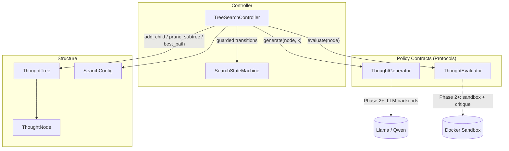
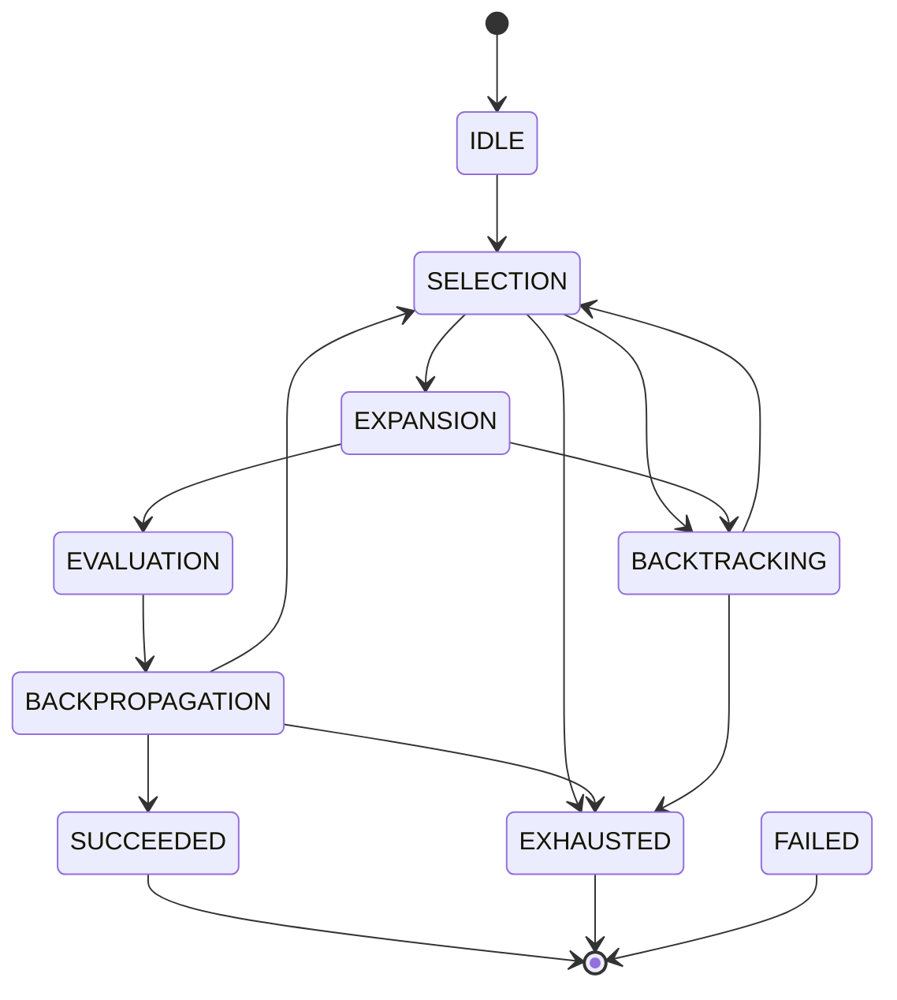

# CognitiveTree-AI

An autonomous reasoning framework that solves complex logic tasks by generating
branching thought trees with an open-source LLM (Llama 3.3 / Qwen 2.5),
validating intermediate code executions in a secure Docker sandbox, and
applying a critique loop with backtracking.

## Development Phases

| Phase | Scope | Status |
|-------|-------|--------|
| 1 | Core state machine, node architecture, MCTS / Tree-of-Thoughts logic | **Complete** |
| 2 | Isolated Docker sandbox environment and execution interfacing | **Complete** |
| 3 | Critique, reward scoring, and backtracking controller loop | Pending |
| 4 | LangGraph / native graph integration and streaming UI | Pending |

## Architecture (Phase 1)

The core is a strict layering: structural primitives at the bottom, policy
contracts in the middle, and the search controller on top. Model backends and
sandboxes attach exclusively through the policy contracts, so later phases
extend the system without modifying the search core.



### Search State Machine

Every phase change flows through a guarded transition table, producing a
complete, replayable trace of each run. Illegal orderings raise
`InvalidTransitionError` instead of silently corrupting control flow.



`FAILED` is reachable from every non-terminal phase and is entered when a
policy backend raises; the fault is captured on the `SearchResult` rather than
escaping the run.

### Search Cycle

1. **Selection** — descends from the root via UCT (`mean value +
   c·sqrt(ln N_parent / N_child)`); unvisited nodes score infinity so every
   fresh candidate is explored before revisiting scored ones. Saturated
   branches (all children pruned or failed) collapse upward during descent —
   this is the structural backtracking mechanism.
2. **Expansion** — requests `branching_factor` candidate thoughts from the
   generator; blank and duplicate candidates are discarded. An empty result
   marks the node as a dead end and triggers an explicit `BACKTRACKING`
   transition.
3. **Evaluation** — scores each fresh child. Terminal verdicts at or above
   `accept_threshold` become accepted solutions; terminal verdicts below it
   are pruned (a completed line of reasoning cannot be extended); scores under
   `prune_threshold` are pruned outright.
4. **Backpropagation** — folds each child's score into every ancestor's visit
   statistics, steering subsequent UCT descents.

### Module Map

| Module | Responsibility |
|--------|----------------|
| `cognitivetree/config.py` | Immutable, validated search parameters |
| `cognitivetree/state.py` | Guarded finite-state machine with transition trace |
| `cognitivetree/node.py` | Thought node: content, lifecycle status, MCTS statistics, UCT |
| `cognitivetree/tree.py` | Indexed tree container: frontier, pruning, best path, rendering, serialization |
| `cognitivetree/policies.py` | `ThoughtGenerator` / `ThoughtEvaluator` protocols and the `Evaluation` verdict |
| `cognitivetree/search.py` | MCTS controller, event emission, `SearchResult` |
| `cognitivetree/demo.py` | Deterministic reference domain exercising the full loop without model dependencies |
| `cognitivetree/sandbox/spec.py` | Execution contracts: `ExecutionRequest` / `ExecutionResult`, `ResourceLimits`, status taxonomy |
| `cognitivetree/sandbox/executor.py` | `CodeExecutor` protocol implemented by every backend |
| `cognitivetree/sandbox/docker_executor.py` | Hardened single-use container backend and image bootstrap |
| `cognitivetree/sandbox/subprocess_executor.py` | Host-process fallback for hosts without a Docker daemon (no isolation) |
| `cognitivetree/sandbox/extraction.py` | Fenced-code payload extraction from thought content |
| `cognitivetree/sandbox/evaluation.py` | `CodeExecutionEvaluator` bridging execution verdicts into the search core |
| `cognitivetree/sandbox/image/Dockerfile` | Minimal-surface sandbox image (no pip, unprivileged user) |
| `cognitivetree/sandbox/demo.py` | End-to-end demo: search converging on execution-validated code |

## Sandbox Security Model (Phase 2)

Every payload runs in a fresh, disposable container with a defense-in-depth
profile applied at `docker run` time:

| Control | Flag | Effect |
|---------|------|--------|
| Network isolation | `--network none` | No egress or ingress whatsoever |
| Filesystem | `--read-only` + `--tmpfs /tmp` | Immutable rootfs; only a size-capped scratch tmpfs is writable |
| Privileges | `--cap-drop ALL`, `--security-opt no-new-privileges`, `--user 65534:65534` | No capabilities, no escalation, unprivileged uid |
| Memory | `--memory` = `--memory-swap` | Hard cap with swap escape closed |
| CPU / processes | `--cpus`, `--pids-limit` | Quota enforcement; fork bombs bounded |
| Lifetime | `--rm` + deadline kill | Timed-out containers are force-removed |

Payloads reach the interpreter as an exec-form `python -I -c` argument —
never through a shell — and captured output is clipped at a configurable
limit before it re-enters the framework. The image itself ships without
`pip`/`setuptools`, so a compromised payload cannot install dependencies.

Execution outcomes are classified in three tiers: `COMPLETED` (the payload
ran; the exit code carries the verdict), `TIMEOUT` (killed at the deadline),
and `SANDBOX_ERROR` (infrastructure fault). Only the last one raises into the
search loop — producing a `FAILED` run — so infrastructure problems are never
misread as "the reasoning was wrong."

## Quickstart

Requires Python 3.10+. The Phase 1 core has zero runtime dependencies.

```bash
# Install in editable mode with the test toolchain
python -m pip install -e .[dev]

# Run the test suite
python -m pytest

# Run the deterministic reference search end-to-end
python -m cognitivetree.demo

# Build the sandbox image (requires a running Docker daemon)
docker build --tag cognitivetree-sandbox:latest cognitivetree/sandbox/image

# Run the execution-grounded search demo (prefers Docker, falls back to
# a non-isolated host process when no daemon is reachable)
python -m cognitivetree.sandbox.demo
```

Docker-dependent integration tests skip automatically when the daemon or the
sandbox image is unavailable, so the suite stays green on any host.

The demo prints the live phase trace, the final ASCII tree (`*` evaluated,
`x` pruned, `#` accepted terminal), and the recovered solution path.

## Design Decisions

- **State machine over implicit control flow** — the controller cannot enter
  an illegal phase ordering; every run yields an auditable transition history
  that Phase 4 streams to the UI.
- **Protocol-based policy boundary** — the search core never imports model or
  sandbox code. Phase 2 and 3 implement the same two protocols, keeping the
  core untouched and independently testable.
- **Terminal-below-threshold prunes instead of lingering** — completed
  thoughts that fail acceptance cannot be extended, so keeping them live would
  only distort UCT statistics.
- **Deterministic under a fixed seed** — tie-breaking randomness is injected
  through a seeded RNG, making full runs reproducible for tests and debugging.
- **Metadata extension point** — `ThoughtNode.metadata` carries
  phase-specific payloads (execution results, critique records) without
  schema churn in the core.
