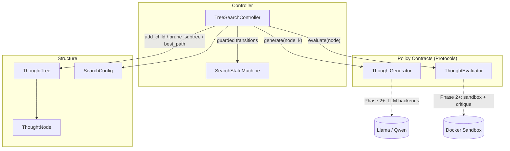
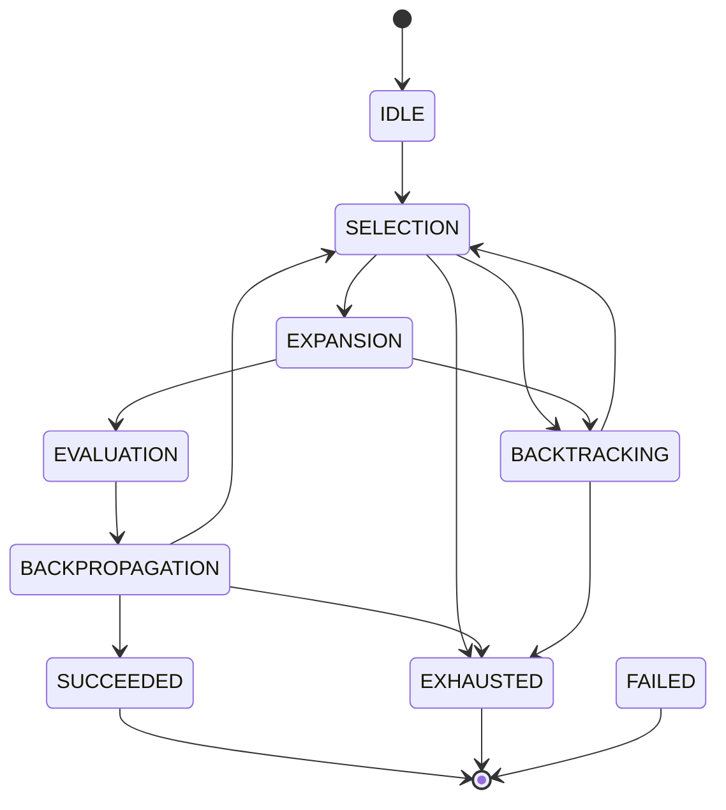

# CognitiveTree-AI

[](https://github.com/Carlosmarroquin20/CognitiveTree-AI/actions/workflows/ci.yml)


An autonomous reasoning framework that solves complex logic tasks by generating
branching thought trees with an open-source LLM (Llama 3.3 / Qwen 2.5),
validating intermediate code executions in a secure Docker sandbox, and
applying a critique loop with backtracking.

## Development Phases

| Phase | Scope | Status |
|-------|-------|--------|
| 1 | Core state machine, node architecture, MCTS / Tree-of-Thoughts logic | **Complete** |
| 2 | Isolated Docker sandbox environment and execution interfacing | **Complete** |
| 3 | Critique, reward scoring, and backtracking controller loop | **Complete** |
| 4 | LLM backends, LangGraph integration, and streaming UI | **Complete** |

## Architecture (Phase 1)

The core is a strict layering: structural primitives at the bottom, policy
contracts in the middle, and the search controller on top. Model backends and
sandboxes attach exclusively through the policy contracts, so later phases
extend the system without modifying the search core.



### Search State Machine

Every phase change flows through a guarded transition table, producing a
complete, replayable trace of each run. Illegal orderings raise
`InvalidTransitionError` instead of silently corrupting control flow.



`FAILED` is reachable from every non-terminal phase and is entered when a
policy backend raises; the fault is captured on the `SearchResult` rather than
escaping the run.

### Search Cycle

1. **Selection** — descends from the root via UCT (`mean value +
   c·sqrt(ln N_parent / N_child)`); unvisited nodes score infinity so every
   fresh candidate is explored before revisiting scored ones. Saturated
   branches (all children pruned or failed) collapse upward during descent —
   this is the structural backtracking mechanism.
2. **Expansion** — requests `branching_factor` candidate thoughts from the
   generator; blank and duplicate candidates are discarded. An empty result
   marks the node as a dead end and triggers an explicit `BACKTRACKING`
   transition.
3. **Evaluation** — scores each fresh child. Terminal verdicts at or above
   `accept_threshold` become accepted solutions; terminal verdicts below it
   are pruned (a completed line of reasoning cannot be extended); scores under
   `prune_threshold` are pruned outright.
4. **Backpropagation** — folds each child's score into every ancestor's visit
   statistics, steering subsequent UCT descents.

### Module Map

| Module | Responsibility |
|--------|----------------|
| `cognitivetree/config.py` | Immutable, validated search parameters |
| `cognitivetree/state.py` | Guarded finite-state machine with transition trace |
| `cognitivetree/node.py` | Thought node: content, lifecycle status, MCTS statistics, UCT |
| `cognitivetree/tree.py` | Indexed tree container: frontier, pruning, best path, rendering, serialization |
| `cognitivetree/policies.py` | `ThoughtGenerator` / `ThoughtEvaluator` protocols and the `Evaluation` verdict |
| `cognitivetree/search.py` | MCTS controller, event emission, `SearchResult` |
| `cognitivetree/demo.py` | Deterministic reference domain exercising the full loop without model dependencies |
| `cognitivetree/sandbox/spec.py` | Execution contracts: `ExecutionRequest` / `ExecutionResult`, `ResourceLimits`, status taxonomy |
| `cognitivetree/sandbox/executor.py` | `CodeExecutor` protocol implemented by every backend |
| `cognitivetree/sandbox/docker_executor.py` | Hardened single-use container backend and image bootstrap |
| `cognitivetree/sandbox/subprocess_executor.py` | Host-process fallback for hosts without a Docker daemon (no isolation) |
| `cognitivetree/sandbox/extraction.py` | Fenced-code payload extraction from thought content |
| `cognitivetree/sandbox/evaluation.py` | `CodeExecutionEvaluator` bridging execution verdicts into the search core |
| `cognitivetree/sandbox/image/Dockerfile` | Minimal-surface sandbox image (no pip, unprivileged user) |
| `cognitivetree/sandbox/demo.py` | End-to-end demo: search converging on execution-validated code |
| `cognitivetree/feedback/execution_critic.py` | `ExecutionTraceCritic`: failure classification and revision guidance from execution records |
| `cognitivetree/feedback/rewards.py` | `RewardShaper` / `RewardWeights`: composite backpropagation values with audit trail |
| `cognitivetree/feedback/revision.py` | `BoundedRevisionPolicy` and revision-notes compilation |
| `cognitivetree/feedback/demo.py` | End-to-end demo of the fail → critique → revise → succeed cycle |
| `cognitivetree/llm/client.py` | Completion contracts: `LlmClient`, `ChatMessage`, `CompletionRequest/Response` |
| `cognitivetree/llm/openai_compatible.py` | HTTP client for Ollama / vLLM / llama.cpp / LM Studio, injected transport, bounded retries |
| `cognitivetree/llm/generator.py` | `LlmThoughtGenerator`: path- and revision-aware expansion prompting |
| `cognitivetree/llm/critic.py` | `LlmCritic`: JSON-verdict semantic critique, degrades instead of failing |
| `cognitivetree/llm/prompts.py` | Auditable prompt templates for the LLM policies |
| `cognitivetree/feedback/composite.py` | `ChainedCritic`: deterministic critic first, model critic second |
| `cognitivetree/sandbox/backends.py` | Executor selection with TTL-cached daemon probing |
| `cognitivetree/session.py` | `ReasoningSession` lifecycle plus reference / LLM assembly factories |
| `cognitivetree/ui/` | SSE event vocabulary, threaded HTTP server, embedded single-file client, CLI |
| `cognitivetree/integrations/langgraph_adapter.py` | Optional LangGraph embedding of full reasoning runs |

## LLM Backends and Streaming Interface (Phase 4)

### Model backends

Every targeted open-source runtime (Ollama, vLLM, llama.cpp server, LM
Studio) speaks the OpenAI-compatible chat-completions dialect, so one
standard-library client covers them all. `LlmThoughtGenerator` prompts with
the task, the reasoning path, and any revision notes; candidates come back
separated by `### CANDIDATE` markers, which survive embedded code fences.
`LlmCritic` requests a strict JSON verdict and **degrades to `None`** on
backend or parse failures — a network blip never aborts a search — while
generator failures deliberately fail the run, since expansion is essential.

```bash
# Deterministic reference scenario (no model, full critique loop)
python -m cognitivetree.ui.serve

# Llama 3.3 via Ollama
python -m cognitivetree.ui.serve --backend llm \
    --base-url http://localhost:11434/v1 --model llama3.3 \
    --task "Implement a run-length encoder as encode(text)." \
    --harness-file checks.py

# Qwen 2.5 via vLLM, with the chained LLM critic
python -m cognitivetree.ui.serve --backend llm \
    --base-url http://localhost:8000/v1 --model Qwen/Qwen2.5-Coder-32B-Instruct \
    --task "..." --llm-critic
```

### Streaming interface

`ReasoningSession.stream()` runs the search on a worker thread and yields
JSON envelopes in order; the SSE server maps them 1:1 onto `EventSource`
events. Each `/stream` connection triggers an independent run.

| SSE event | Payload | Emitted |
|-----------|---------|---------|
| `phase` | iteration, phase, node id, detail | every state-machine transition |
| `snapshot` | full serialized tree | at backpropagation and terminal phases |
| `result` | outcome, iterations, node count, solution, best path | once, closing the run |

The embedded page (served at `/`) renders the phase log, the live thought
tree, and the accepted solution with zero external assets.

### LangGraph embedding

The native FSM-supervised controller remains the execution engine.
`build_reasoning_graph` packages a complete run as a single LangGraph node
(`pip install cognitivetree-ai[langgraph]`), so the framework composes into
larger agent pipelines without re-hosting the search loop phase-by-phase —
one source of truth for control flow, no graph-runtime overhead per phase.

## Critique-Driven Backtracking (Phase 3)

Backtracking operates on two levels. Structural backtracking (Phase 1)
prunes a node whose children have all failed, returning effort to the nearest
viable ancestor. Semantic backtracking (Phase 3) intercepts that pruning:

1. When a child is pruned, the **critic** diagnoses the failure from its
   execution record — assertion message, exception class, syntax fault, or
   timeout — and stores a structured critique with actionable guidance in
   ``node.metadata["critique"]``.
2. When a node saturates (every child dead), the **revision policy** decides
   whether it earns another attempt. `BoundedRevisionPolicy` grants at most
   ``max_attempts`` revisions per node, requires critique guidance to learn
   from, compiles the children's guidance into deduplicated
   ``revision_notes``, and reopens the node.
3. The **generator** reads the notes at re-expansion (an LLM backend injects
   them into the prompt; the reference generators branch on them) and
   proposes revised candidates. Deduplication against existing children
   guarantees a failed candidate is never resubmitted verbatim.
4. The **reward model** shapes the value that backpropagates: a weighted
   blend of the raw evaluator score, the critique term (``1 − severity``),
   and a shallowness term that biases search toward shorter chains. The
   component breakdown is stored in ``node.metadata["reward"]``.

Solution acceptance always operates on the raw evaluator score; shaping
influences only where the search looks next. All Phase 3 hooks are optional
constructor arguments on `TreeSearchController` — omitted, the controller
reproduces the plain Phase 1 behavior exactly.

### Node Metadata Registry

| Key | Writer | Content |
|-----|--------|---------|
| `execution` | `CodeExecutionEvaluator` | Sandbox verdict: status, exit code, streams, duration |
| `critique` | `TreeSearchController` (via `Critic`) | Failure class, summary, guidance, severity |
| `reward` | `RewardShaper` | Component breakdown of the shaped value |
| `revision_notes` | `BoundedRevisionPolicy` | Compiled guidance handed to the generator |
| `revision_attempts` | `BoundedRevisionPolicy` | Consumed revision budget |

## Sandbox Security Model (Phase 2)

Every payload runs in a fresh, disposable container with a defense-in-depth
profile applied at `docker run` time:

| Control | Flag | Effect |
|---------|------|--------|
| Network isolation | `--network none` | No egress or ingress whatsoever |
| Filesystem | `--read-only` + `--tmpfs /tmp` | Immutable rootfs; only a size-capped scratch tmpfs is writable |
| Privileges | `--cap-drop ALL`, `--security-opt no-new-privileges`, `--user 65534:65534` | No capabilities, no escalation, unprivileged uid |
| Memory | `--memory` = `--memory-swap` | Hard cap with swap escape closed |
| CPU / processes | `--cpus`, `--pids-limit` | Quota enforcement; fork bombs bounded |
| Lifetime | `--rm` + deadline kill | Timed-out containers are force-removed |

Payloads reach the interpreter as an exec-form `python -I -c` argument —
never through a shell — and captured output is clipped at a configurable
limit before it re-enters the framework. The image itself ships without
`pip`/`setuptools`, so a compromised payload cannot install dependencies.

Execution outcomes are classified in three tiers: `COMPLETED` (the payload
ran; the exit code carries the verdict), `TIMEOUT` (killed at the deadline),
and `SANDBOX_ERROR` (infrastructure fault). Only the last one raises into the
search loop — producing a `FAILED` run — so infrastructure problems are never
misread as "the reasoning was wrong."

## Quickstart

Requires Python 3.10+. The Phase 1 core has zero runtime dependencies.

```bash
# Install in editable mode with the test toolchain
python -m pip install -e .[dev]

# Run the test suite
python -m pytest

# Run the deterministic reference search end-to-end
python -m cognitivetree.demo

# Build the sandbox image (requires a running Docker daemon)
docker build --tag cognitivetree-sandbox:latest cognitivetree/sandbox/image

# Run the execution-grounded search demo (prefers Docker, falls back to
# a non-isolated host process when no daemon is reachable)
python -m cognitivetree.sandbox.demo

# Run the critique-driven backtracking demo (fail -> critique -> revise -> succeed)
python -m cognitivetree.feedback.demo

# Serve the live streaming interface (reference scenario) at http://127.0.0.1:8732/
python -m cognitivetree.ui.serve
```

Docker-dependent integration tests skip automatically when the daemon or the
sandbox image is unavailable, so the suite stays green on any host.

The demo prints the live phase trace, the final ASCII tree (`*` evaluated,
`x` pruned, `#` accepted terminal), and the recovered solution path.

## Continuous Integration

Every push and pull request against `main` runs `.github/workflows/ci.yml`:

| Job | Runner(s) | Verifies |
|-----|-----------|----------|
| `lint` | Ubuntu · 3.12 | `ruff check` at line-length 100 (`E,F,I,W,B,C4,UP,SIM`) |
| `test` | Ubuntu · 3.10 / 3.11 / 3.12, plus Windows · 3.12 | Pure-Python suite across versions and both operating systems; Docker tests skip without a built image |
| `integration` | Ubuntu · 3.12 | Full suite with the hardened sandbox image **built and running** and the `langgraph` extra installed |

The split keeps the version matrix fast while giving the security-sensitive
sandbox and the optional LangGraph embedding real, executed coverage once per
run. Lint findings surface as inline PR annotations.

Run the same gates locally before pushing:

```bash
python -m pip install -e ".[dev]"
ruff check .
python -m pytest
```

## Design Decisions

- **State machine over implicit control flow** — the controller cannot enter
  an illegal phase ordering; every run yields an auditable transition history
  that Phase 4 streams to the UI.
- **Protocol-based policy boundary** — the search core never imports model or
  sandbox code. Phase 2 and 3 implement the same two protocols, keeping the
  core untouched and independently testable.
- **Terminal-below-threshold prunes instead of lingering** — completed
  thoughts that fail acceptance cannot be extended, so keeping them live would
  only distort UCT statistics.
- **Deterministic under a fixed seed** — tie-breaking randomness is injected
  through a seeded RNG, making full runs reproducible for tests and debugging.
- **Metadata extension point** — `ThoughtNode.metadata` carries
  phase-specific payloads (execution results, critique records) without
  schema churn in the core.
- **Committing revision grants** — `RevisionPolicy.revise` prepares the node
  (notes, attempt accounting) before answering, so a granted revision can
  never be observed half-applied by the controller.
- **Raw acceptance, shaped guidance** — reward shaping deliberately cannot
  promote a failing thought into a solution; it only redirects exploration.
- **Deterministic critics before LLM critics** — traceback classification
  covers the execution-grounded failure modes without model calls; an LLM
  critic implements the same `Critic` protocol in Phase 4 for semantic
  failures that leave no traceback.
