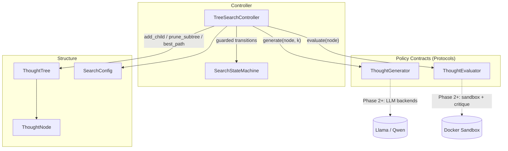
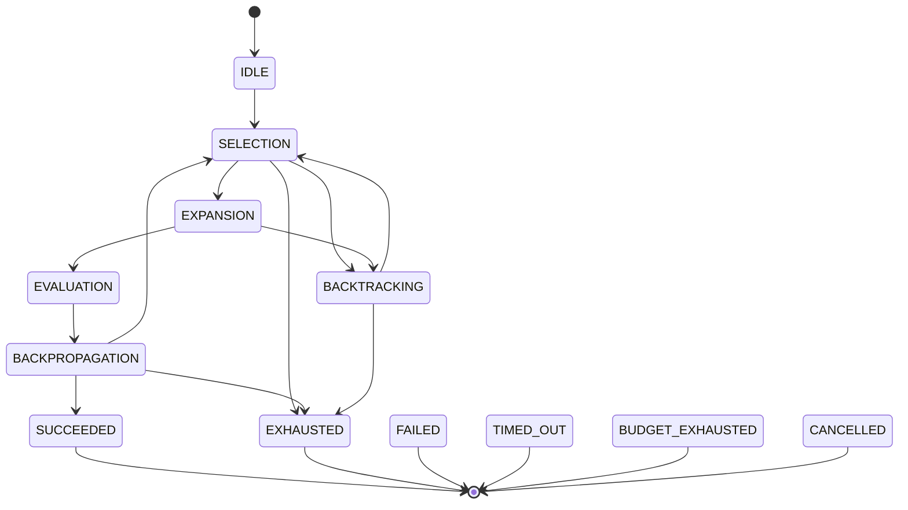

# CognitiveTree-AI

[](https://github.com/Carlosmarroquin20/CognitiveTree-AI/actions/workflows/ci.yml)


An autonomous reasoning framework that solves complex logic tasks by generating
branching thought trees with an open-source LLM (Llama 3.3 / Qwen 2.5),
validating intermediate code executions in a secure Docker sandbox, and
applying a critique loop with backtracking.

## Development Phases

| Phase | Scope | Status |
|-------|-------|--------|
| 1 | Core state machine, node architecture, MCTS / Tree-of-Thoughts logic | **Complete** |
| 2 | Isolated Docker sandbox environment and execution interfacing | **Complete** |
| 3 | Critique, reward scoring, and backtracking controller loop | **Complete** |
| 4 | LLM backends, LangGraph integration, and streaming UI | **Complete** |

## Architecture (Phase 1)

The core is a strict layering: structural primitives at the bottom, policy
contracts in the middle, and the search controller on top. Model backends and
sandboxes attach exclusively through the policy contracts, so later phases
extend the system without modifying the search core.


```mermaid
flowchart TB
    subgraph Controller
        SC[TreeSearchController]
        SM[SearchStateMachine]
    end
    subgraph Policies["Policy Contracts (Protocols)"]
        TG[ThoughtGenerator]
        TE[ThoughtEvaluator]
    end
    subgraph Structure
        TT[ThoughtTree]
        TN[ThoughtNode]
        CFG[SearchConfig]
    end
    SC -- "guarded transitions" --> SM
    SC -- "generate(node, k)" --> TG
    SC -- "evaluate(node)" --> TE
    SC -- "add_child / prune_subtree / best_path" --> TT
    TT --> TN
    SC --> CFG
    TG -. "Phase 2+: LLM backends" .-> LLM[(Llama / Qwen)]
    TE -. "Phase 2+: sandbox + critique" .-> DK[(Docker Sandbox)]
```

### Search State Machine

Every phase change flows through a guarded transition table, producing a
complete, replayable trace of each run. Illegal orderings raise
`InvalidTransitionError` instead of silently corrupting control flow.


```mermaid
stateDiagram-v2
    [*] --> IDLE
    IDLE --> SELECTION
    SELECTION --> EXPANSION
    SELECTION --> BACKTRACKING
    SELECTION --> EXHAUSTED
    EXPANSION --> EVALUATION
    EXPANSION --> BACKTRACKING
    EVALUATION --> BACKPROPAGATION
    BACKPROPAGATION --> SELECTION
    BACKPROPAGATION --> SUCCEEDED
    BACKPROPAGATION --> EXHAUSTED
    BACKTRACKING --> SELECTION
    BACKTRACKING --> EXHAUSTED
    SUCCEEDED --> [*]
    EXHAUSTED --> [*]
    FAILED --> [*]
    TIMED_OUT --> [*]
    BUDGET_EXHAUSTED --> [*]
    CANCELLED --> [*]
```

Four terminal phases share one universal reachability set, because each
represents an external constraint that can strike from any non-terminal
phase: `FAILED` when a policy backend raises (the fault is captured on the
`SearchResult` rather than escaping the run), `TIMED_OUT` when the global
wall-clock budget elapses (**Global Time Budget** below),
`BUDGET_EXHAUSTED` when a consumption ceiling is reached (**Consumption
Budgets** below), and `CANCELLED` when the caller sets the `cancel_event`
passed to `run()`. The last three stay distinct because they call for
different responses: retry later, raise the quota, or nothing at all, since
no one is waiting for the result. Cancellation is checked at the same
iteration boundary as the other limits, and ahead of them.

### Search Cycle

1. **Selection** — descends from the root via UCT (`mean value +
   c·sqrt(ln N_parent / N_child)`); unvisited nodes score infinity so every
   fresh candidate is explored before revisiting scored ones. Saturated
   branches (all children pruned or failed) collapse upward during descent —
   this is the structural backtracking mechanism.
2. **Expansion** — requests `branching_factor` candidate thoughts from the
   generator; blank and duplicate candidates are discarded. An empty result
   marks the node as a dead end and triggers an explicit `BACKTRACKING`
   transition.
3. **Evaluation** — scores each fresh child. Terminal verdicts at or above
   `accept_threshold` become accepted solutions; terminal verdicts below it
   are pruned (a completed line of reasoning cannot be extended); scores under
   `prune_threshold` are pruned outright.
4. **Backpropagation** — folds each child's score into every ancestor's visit
   statistics, steering subsequent UCT descents.

### Global Time Budget

`SearchConfig.max_wall_seconds` caps the entire run's wall-clock duration —
independent of, and typically tighter than, the per-execution timeouts the
sandbox (`ResourceLimits.timeout_seconds`) and the LLM client already enforce
on individual calls. `None` (the default) leaves the search unbounded,
matching every prior release.

The deadline is checked once per iteration, at the boundary before that
iteration's expansion begins — the same granularity at which `max_iterations`
already bounds work. A run that crosses the deadline stops in the new
`TIMED_OUT` phase with exactly the iterations completed so far on
`SearchResult.iterations`, and its cause is distinguishable in
`phase_history` from `EXHAUSTED` (iteration budget spent) and `FAILED`
(a policy backend raised):

```python
from cognitivetree.config import SearchConfig
from cognitivetree.search import SearchOutcome, TreeSearchController

controller = TreeSearchController(
    config=SearchConfig(max_wall_seconds=30.0),  # stop after 30s, however far the search got
    generator=my_generator,
    evaluator=my_evaluator,
)
result = controller.run("...")
if result.outcome is SearchOutcome.TIMED_OUT:
    ...  # act on the best partial result via result.best_path
```

This is a cooperative, iteration-boundary check, not preemption: it cannot
interrupt an in-flight generator, critic, or sandboxed execution call, so one
unusually slow iteration can overshoot the deadline by its own duration.
Preemptive cancellation was deliberately left out — forcibly killing a
mid-flight sandboxed subprocess or Docker container from a watchdog thread
risks leaving it in an inconsistent state, which is a correctness risk out of
proportion to what a soft wall-clock budget needs to guarantee.

The `--max-seconds` flag threads this into the streaming CLI across all
backends (see below).

### Parallel Evaluation

Evaluation dominates the cost of a run — the metrics report attributes
essentially all measurable wall time to it, because each verdict may spawn a
sandboxed container. Candidates within one expansion batch are independent,
so `SearchConfig.evaluation_workers` evaluates them concurrently:

```python
SearchConfig(branching_factor=3, evaluation_workers=3)   # ~1.86x measured
```

Concurrency is **opt-in** (`1` by default) for one reason: a custom
`ThoughtEvaluator` is not required to be thread-safe. The bundled sandbox
evaluators are — each container gets a unique name, and each thread writes
only to its own node.

Two invariants hold at any worker count, which is what keeps a seeded run
reproducible and its failures diagnosable:

- **Verdicts apply in candidate order, never completion order**, so
  acceptance, pruning, and backpropagation see exactly the sequence a
  sequential run would.
- **When several candidates fail, the earliest one's exception propagates**,
  so the reported error does not depend on thread scheduling.

Both follow from `Executor.map`, which yields in submission order and
re-raises at the first failing position. A batch of one candidate skips the
pool entirely, so the default path takes on no thread-pool machinery at all.
The test suite proves the concurrency is real with a `threading.Barrier`
rendezvous rather than a timing heuristic, and proves the sequential default
does *not* overlap by asserting the same barrier breaks.

Note that parallel evaluation widens the overshoot window on both budgets
below: an iteration can now spend a whole batch of sandbox executions or LLM
calls between two boundary checks.

### Consumption Budgets

Token spend cannot be a `SearchConfig` field the way time is. The controller
can read a clock; it cannot read the LLM client's running tally without
importing model-specific code across the policy boundary this package is
built around. So consumption budgets invert the relationship through the
`StopCondition` protocol — the caller owns the resource and reports only a
verdict:

```python
class StopCondition(Protocol):
    def check(self) -> str | None: ...   # a reason to stop, or None to continue
```

`TokenBudget` implements it over the same `AccountingLlmClient` used for
metrics, so the ceiling is enforced against exactly what the backend
reported rather than an estimate:

```python
from cognitivetree import AccountingLlmClient, TokenBudget, TreeSearchController

client = AccountingLlmClient(OpenAICompatibleClient(...))
controller = TreeSearchController(
    config=SearchConfig(),
    generator=LlmThoughtGenerator(client),
    evaluator=my_evaluator,
    stop_condition=TokenBudget(client, max_total_tokens=5000, max_calls=40),
)
result = controller.run("...")   # outcome may be BUDGET_EXHAUSTED
```

The condition is polled at the same iteration boundary as the deadline, and
the deadline is tested first, so a run crossing both limits in one iteration
reports as timed out. The same cooperative-boundary caveat applies, and it
matters more here because it is quantifiable: **the final total can exceed
the ceiling by roughly one iteration's consumption**, so size the ceiling
below a hard quota rather than at it. Both ceilings are independent and
optional; whichever is crossed first ends the run, and the reason string is
recorded verbatim on the transition:

```text
token budget of 50 exhausted: 210 consumed across 1 calls
```

`LlmSessionSpec.max_tokens` / `max_llm_calls` and the CLI's `--max-tokens` /
`--max-llm-calls` wire this through the session layer, wrapping the client
for accounting automatically. The flags are refused on the `reference`
backend, which runs no model and would silently never fire them.

### Module Map

| Module | Responsibility |
|--------|----------------|
| `cognitivetree/config.py` | Immutable, validated search parameters |
| `cognitivetree/state.py` | Guarded finite-state machine with transition trace |
| `cognitivetree/node.py` | Thought node: content, lifecycle status, MCTS statistics, UCT |
| `cognitivetree/tree.py` | Indexed tree container: frontier, pruning, best path, rendering, serialization |
| `cognitivetree/policies.py` | `ThoughtGenerator` / `ThoughtEvaluator` protocols and the `Evaluation` verdict |
| `cognitivetree/search.py` | MCTS controller, event emission, `SearchResult` |
| `cognitivetree/demo.py` | Deterministic reference domain exercising the full loop without model dependencies |
| `cognitivetree/sandbox/spec.py` | Execution contracts: `ExecutionRequest` / `ExecutionResult`, `ResourceLimits`, status taxonomy |
| `cognitivetree/sandbox/executor.py` | `CodeExecutor` protocol implemented by every backend |
| `cognitivetree/sandbox/docker_executor.py` | Hardened single-use container backend and image bootstrap |
| `cognitivetree/sandbox/subprocess_executor.py` | Host-process fallback for hosts without a Docker daemon (no isolation) |
| `cognitivetree/sandbox/extraction.py` | Fenced-code payload extraction from thought content |
| `cognitivetree/sandbox/evaluation.py` | `CodeExecutionEvaluator` bridging execution verdicts into the search core |
| `cognitivetree/sandbox/image/Dockerfile` | Minimal-surface sandbox image (no pip, unprivileged user) |
| `cognitivetree/sandbox/demo.py` | End-to-end demo: search converging on execution-validated code |
| `cognitivetree/feedback/execution_critic.py` | `ExecutionTraceCritic`: failure classification and revision guidance from execution records |
| `cognitivetree/feedback/rewards.py` | `RewardShaper` / `RewardWeights`: composite backpropagation values with audit trail |
| `cognitivetree/feedback/revision.py` | `BoundedRevisionPolicy` and revision-notes compilation |
| `cognitivetree/feedback/demo.py` | End-to-end demo of the fail → critique → revise → succeed cycle |
| `cognitivetree/llm/client.py` | Completion contracts: `LlmClient`, `ChatMessage`, `CompletionRequest/Response` |
| `cognitivetree/llm/openai_compatible.py` | HTTP client for Ollama / vLLM / llama.cpp / LM Studio, injected transport, bounded retries with exponential backoff |
| `cognitivetree/llm/caching.py` | `CachingLlmClient`: bounded LRU replay of identical deterministic requests; hits report zero tokens |
| `cognitivetree/llm/generator.py` | `LlmThoughtGenerator`: path- and revision-aware expansion prompting |
| `cognitivetree/llm/critic.py` | `LlmCritic`: JSON-verdict semantic critique, degrades instead of failing |
| `cognitivetree/llm/prompts.py` | Auditable prompt templates for the LLM policies |
| `cognitivetree/llm/scripted.py` | `ScriptedLlmClient`: deterministic backend double for offline demos and tests |
| `cognitivetree/llm/demo.py` | Offline LLM run: real adapters driven by a scripted client, no model |
| `cognitivetree/feedback/composite.py` | `ChainedCritic`: deterministic critic first, model critic second |
| `cognitivetree/sandbox/backends.py` | Executor selection with TTL-cached daemon probing |
| `cognitivetree/session.py` | `ReasoningSession` lifecycle plus reference / LLM assembly factories |
| `cognitivetree/ui/` | SSE event vocabulary, threaded HTTP server, embedded single-file client, CLI |
| `cognitivetree/integrations/langgraph_adapter.py` | Optional LangGraph embedding of full reasoning runs |
| `cognitivetree/observability/metrics.py` | `RunMetrics` / `TokenUsage`: post-hoc run summary projected from the result |
| `cognitivetree/observability/accounting.py` | `AccountingLlmClient`: transparent token/call tallying wrapper |
| `cognitivetree/observability/budget.py` | `TokenBudget`: the same tally used as a `StopCondition` |
| `cognitivetree/persistence/archive.py` | Versioned JSON run archives: `save_run` / `load_run`, rehydrated into a real `SearchResult` |
| `cognitivetree/persistence/replay.py` | `ReplaySession`: re-streams an archive through the live envelope vocabulary |
| `cognitivetree/persistence/demo.py` | Archive a timed-out run, discard it, reopen and diagnose it offline |
| `cognitivetree/benchmark/suite.py` | `BenchmarkTask` contract and the bundled search suite (terminal-only feedback) |
| `cognitivetree/benchmark/runner.py` | Runner, `BenchmarkReport`, scaling curve, and head-to-head comparison |
| `cognitivetree/benchmark/run.py` | CLI: `python -m cognitivetree.benchmark.run` |

## LLM Backends and Streaming Interface (Phase 4)

### Model backends

Every targeted open-source runtime (Ollama, vLLM, llama.cpp server, LM
Studio) speaks the OpenAI-compatible chat-completions dialect, so one
standard-library client covers them all. `LlmThoughtGenerator` prompts with
the task, the reasoning path, and any revision notes; candidates come back
separated by `### CANDIDATE` markers, which survive embedded code fences.
`LlmCritic` requests a strict JSON verdict and **degrades to `None`** on
backend or parse failures — a network blip never aborts a search — while
generator failures deliberately fail the run, since expansion is essential.

```bash
# Deterministic reference scenario (no model, full critique loop)
python -m cognitivetree.ui.serve

# Llama 3.3 via Ollama
python -m cognitivetree.ui.serve --backend llm \
    --base-url http://localhost:11434/v1 --model llama3.3 \
    --task "Implement a run-length encoder as encode(text)." \
    --harness-file checks.py

# Qwen 2.5 via vLLM, with the chained LLM critic
python -m cognitivetree.ui.serve --backend llm \
    --base-url http://localhost:8000/v1 --model Qwen/Qwen2.5-Coder-32B-Instruct \
    --task "..." --llm-critic

# Cap the whole search at 30 seconds of wall-clock time, regardless of backend
python -m cognitivetree.ui.serve --backend llm \
    --base-url http://localhost:11434/v1 --model llama3.3 \
    --task "..." --max-seconds 30
```

Endpoints that require authentication read the bearer token from the
`COGNITIVETREE_API_KEY` environment variable. `--api-key` still works but logs
a warning, because command-line arguments are visible in shell history and
process listings.

`--temperature` (default `0.7`) and `--critic-temperature` (default `0.2`)
set the sampling temperature of the generator and the LLM critic. `0` makes a
role deterministic, which reproducible runs and completion caching need.

`--max-seconds` maps to `SearchConfig.max_wall_seconds` and is honored by all
three backends (`reference`, `llm-demo`, `llm`) — see **Global Time Budget**
above.

### Offline harness (no model required)

`ScriptedLlmClient` satisfies the `LlmClient` contract with prearranged
completions, so the **entire** adapter stack — prompt assembly, `### CANDIDATE`
parsing, JSON critique parsing, revision-note injection — runs through its
production code paths without a live backend. It is the reusable test double
and the driver for the offline demo, and it flows through the same
`build_llm_session` assembly a real endpoint uses (injected via its `client`
argument):

```python
from cognitivetree.llm import ScriptedLlmClient
from cognitivetree.llm.demo import clamp_responder, build_offline_controller

controller = build_offline_controller(client=ScriptedLlmClient(clamp_responder))
result = controller.run("Implement clamp(value, low, high) correctly.")
assert result.outcome.value == "succeeded"
```

```bash
# Print the offline LLM run (fail -> critique -> revise -> succeed via adapters)
python -m cognitivetree.llm.demo

# Stream the LLM path in the UI with no model behind it
python -m cognitivetree.ui.serve --backend llm-demo
```

This is what lets CI and air-gapped hosts exercise the LLM layer end-to-end,
and it keeps the flagship "reasoning with an open-source LLM" flow demonstrable
when no GPU or endpoint is available.

### Streaming interface

`ReasoningSession.stream()` runs the search on a worker thread and yields
JSON envelopes in order; the SSE server maps them 1:1 onto `EventSource`
events. Each `/stream` connection triggers an independent run, and a client
that disconnects cancels it: the run stops at its next iteration boundary in
the `cancelled` phase instead of spending model quota and sandbox time for no
one. `--max-concurrent-runs` (default 4) bounds how many run at once.

| SSE event | Payload | Emitted |
|-----------|---------|---------|
| `phase` | iteration, phase, node id, detail | every state-machine transition |
| `snapshot` | full serialized tree | at backpropagation and terminal phases |
| `metrics` | run-metrics summary (see Observability) | once, as the search settles |
| `result` | outcome, iterations, node count, solution, best path | once, closing the run |

The embedded page (served at `/`) renders the phase log, the live thought
tree, a metrics chip row, and the accepted solution with zero external assets.

### LangGraph embedding

The native FSM-supervised controller remains the execution engine.
`build_reasoning_graph` packages a complete run as a single LangGraph node
(`pip install cognitivetree-ai[langgraph]`), so the framework composes into
larger agent pipelines without re-hosting the search loop phase-by-phase —
one source of truth for control flow, no graph-runtime overhead per phase.

## Observability

`RunMetrics.from_result(result)` projects a completed run onto a quantitative
summary — it reads only the recorded phase history and the final tree, so
metrics impose **no instrumentation on the search core** and can be recomputed
on any archived result. The summary covers outcome, iterations, node-status
counts, solution depth, structural versus revision backtracks, revisions
granted, and per-phase wall time (derived from the transition timestamps) —
the same per-phase timing that shows exactly where a `TIMED_OUT` run spent
its budget.

```python
from cognitivetree import RunMetrics, build_reference_session

result = build_reference_session().run()
print(RunMetrics.from_result(result).format_report())
```

Token usage is captured orthogonally: `AccountingLlmClient` transparently wraps
any `LlmClient` and tallies the prompt/completion tokens the backend reports,
which `from_result` folds into the summary via its `token_usage` argument. The
streaming interface emits the structural summary as a `metrics` envelope and
renders it as a chip row; the terminal report additionally shows tokens:

```bash
python -m cognitivetree.observability.demo
```
```text
run metrics
  outcome            : succeeded
  iterations         : 2
  backtracks         : 0 structural, 1 revision
  revisions granted  : 1
  node status        : pending=1, terminal=1, pruned=3
  phase time (ms)    : evaluation=938.0, selection=15.0
  llm tokens         : 430 (346 prompt + 84 completion) across 2 calls
```

## Benchmarking

The framework has many tunables and no amount of reading the code reveals
which ones pay off. `run_benchmark` executes a task suite under a
configuration and aggregates the outcomes; `compare_reports` puts two
configurations side by side.

The headline measurement is the one a test-time compute framework lives or
dies by — **solve rate as a function of the compute budget**:

```bash
python -m cognitivetree.benchmark.run --budgets 10 40 120
```
```text
compute scaling curve
    budget  solve rate  mean iters  wall (ms)
        10         50%         7.8        2.9
        40         67%        19.3        7.4
       120        100%        28.0       11.0
```

### Why the bundled suite looks the way it does

The suite is hidden-sequence recovery, but it deliberately does **not** reuse
the graded evaluator from `cognitivetree.demo`. That evaluator scores partial
candidates by prefix coverage, which turns the search into a gradient walk:
every task solves in one iteration per token, and every configuration ties at
100% — a benchmark that cannot discriminate.

`TerminalOnlyEvaluator` withholds all signal until a candidate reaches full
length. Nothing can be pruned early, the tree grows as `4 ** length`, and the
controller has to actually search. Difficulty is then graded by target
length, and the suite separates budgets cleanly.

Two measurement details worth knowing:

- **Solved-only mean iterations** is reported alongside the overall mean.
  Unsolved runs terminate at whatever budget stopped them, so folding them
  into one average measures the budget rather than the search.
- **A solve requires matching `expected_solution`**, not merely a
  `SUCCEEDED` outcome, so an evaluator that wrongly accepts cannot inflate
  the score.

### Head-to-head comparison

```bash
python -m cognitivetree.benchmark.run --budgets 120 --compare-exploration 3.0
```
```text
metric             expl=1.414     expl=3   delta
----------------------------------------------------
solve rate               100%       100%   same
mean iterations          28.0       28.0   same
```

That output is a real finding, not a placeholder: on this suite the UCT
exploration weight changes nothing, because unvisited nodes already sort
ahead of every visited one and the withheld signal leaves sibling values
degenerate. Compute budget is what moves the needle here. A benchmark earns
its keep by producing results like that.

`--repeats N` re-runs each task with the seed offset, so an advantage that
was really a lucky tie-break shows up as variance. `--archive-dir` writes
every run to a JSON archive (see below), so a surprising row can be reopened
and inspected later.

## Run Persistence and Replay

A run archive is one self-contained JSON document holding the thought tree
**with its per-node metadata** (execution records, critiques, reward
breakdowns), the full phase history, and the metrics summary. It exists for
the case where a search ended somewhere you cannot debug it interactively —
a CI runner, an air-gapped host, or behind a `TIMED_OUT` deadline.

Loading an archive rehydrates a genuine `SearchResult`, not a parallel
read-only type, so everything that works on a live run works unchanged on an
archived one — `RunMetrics.from_result`, `tree.render()`, `best_path`:

```python
from cognitivetree import RunMetrics, load_run, save_run

save_run(result, "runs/timed-out.json", metrics=RunMetrics.from_result(result).to_dict())

# …later, in another process, on another machine
archive = load_run("runs/timed-out.json")
print(archive.result.phase_history[-1].note)   # wall-clock budget of 30s exhausted
print(archive.result.tree.render())
print(RunMetrics.from_result(archive.result).format_report())
```

Node metadata is serialized **opt-in** (`to_dict(include_metadata=True)`):
archives switch it on because those payloads are exactly what offline
diagnosis needs, while live UI snapshots — re-serialized on every
backpropagation — leave it off and stay lean. The stored `metrics` are kept
rather than always recomputed because token accounting originates outside the
result and cannot be re-derived from the tree.

Archives declare a `format` and `version`; unrecognized or future documents
are refused with `ArchiveFormatError` instead of loading partially.

```bash
# Archive a budget-limited run, drop it from memory, reopen and diagnose it
python -m cognitivetree.persistence.demo

# Re-stream a saved run through the UI — same page, same envelopes, no live search
python -m cognitivetree.ui.serve --backend replay --archive runs/timed-out.json

# Replay at the run's original pace instead of instantly
python -m cognitivetree.ui.serve --backend replay --archive runs/timed-out.json \
    --replay-speed 1.0
```

`ReplaySession` emits the same `phase` / `snapshot` / `metrics` / `result`
envelope sequence a live run produces — a test asserts the two sequences are
identical — so the browser client needs no notion of replay. A bad or missing
archive fails at server startup rather than on the first request. One honest
limit: an archive stores only the tree's **final** state, so every replayed
snapshot carries it; the phase log, recorded per transition, is what conveys
how the run actually progressed.

## Critique-Driven Backtracking (Phase 3)

Backtracking operates on two levels. Structural backtracking (Phase 1)
prunes a node whose children have all failed, returning effort to the nearest
viable ancestor. Semantic backtracking (Phase 3) intercepts that pruning:

1. When a child is pruned, the **critic** diagnoses the failure from its
   execution record — assertion message, exception class, syntax fault, or
   timeout — and stores a structured critique with actionable guidance in
   ``node.metadata["critique"]``.
2. When a node saturates (every child dead), the **revision policy** decides
   whether it earns another attempt. `BoundedRevisionPolicy` grants at most
   ``max_attempts`` revisions per node, requires critique guidance to learn
   from, compiles the children's guidance into deduplicated
   ``revision_notes``, and reopens the node.
3. The **generator** reads the notes at re-expansion (an LLM backend injects
   them into the prompt; the reference generators branch on them) and
   proposes revised candidates. Deduplication against existing children
   guarantees a failed candidate is never resubmitted verbatim.
4. The **reward model** shapes the value that backpropagates: a weighted
   blend of the raw evaluator score, the critique term (``1 − severity``),
   and a shallowness term that biases search toward shorter chains. The
   component breakdown is stored in ``node.metadata["reward"]``.

Solution acceptance always operates on the raw evaluator score; shaping
influences only where the search looks next. All Phase 3 hooks are optional
constructor arguments on `TreeSearchController` — omitted, the controller
reproduces the plain Phase 1 behavior exactly.

### Node Metadata Registry

| Key | Writer | Content |
|-----|--------|---------|
| `execution` | `CodeExecutionEvaluator` | Sandbox verdict: status, exit code, streams, duration |
| `critique` | `TreeSearchController` (via `Critic`) | Failure class, summary, guidance, severity |
| `reward` | `RewardShaper` | Component breakdown of the shaped value |
| `revision_notes` | `BoundedRevisionPolicy` | Compiled guidance handed to the generator |
| `revision_attempts` | `BoundedRevisionPolicy` | Consumed revision budget |

## Sandbox Security Model (Phase 2)

Every payload runs in a fresh, disposable container with a defense-in-depth
profile applied at `docker run` time:

| Control | Flag | Effect |
|---------|------|--------|
| Network isolation | `--network none` | No egress or ingress whatsoever |
| Filesystem | `--read-only` + `--tmpfs /tmp` | Immutable rootfs; only a size-capped scratch tmpfs is writable |
| Privileges | `--cap-drop ALL`, `--security-opt no-new-privileges`, `--user 65534:65534` | No capabilities, no escalation, unprivileged uid |
| Memory | `--memory` = `--memory-swap` | Hard cap with swap escape closed |
| CPU / processes | `--cpus`, `--pids-limit` | Quota enforcement; fork bombs bounded |
| Lifetime | `--rm` + deadline kill | Timed-out containers are force-removed |

Payloads reach the interpreter as an exec-form `python -I -c` argument —
never through a shell — and captured output is clipped at a configurable
limit before it re-enters the framework. The image itself ships without
`pip`/`setuptools`, so a compromised payload cannot install dependencies.

Execution outcomes are classified in three tiers: `COMPLETED` (the payload
ran; the exit code carries the verdict), `TIMEOUT` (killed at the deadline),
and `SANDBOX_ERROR` (infrastructure fault). Only the last one raises into the
search loop — producing a `FAILED` run — so infrastructure problems are never
misread as "the reasoning was wrong."

## Quickstart

Requires Python 3.10+. The Phase 1 core has zero runtime dependencies.

```bash
# Install in editable mode with the test toolchain
python -m pip install -e .[dev]

# Run the test suite
python -m pytest

# Run the deterministic reference search end-to-end
python -m cognitivetree.demo

# Build the sandbox image (requires a running Docker daemon)
docker build --tag cognitivetree-sandbox:latest cognitivetree/sandbox/image

# Run the execution-grounded search demo (prefers Docker, falls back to
# a non-isolated host process when no daemon is reachable)
python -m cognitivetree.sandbox.demo

# Run the critique-driven backtracking demo (fail -> critique -> revise -> succeed)
python -m cognitivetree.feedback.demo

# Run the LLM adapter stack offline via a scripted client (no model required)
python -m cognitivetree.llm.demo

# Print a run-metrics report with token accounting (no model required)
python -m cognitivetree.observability.demo

# Archive a timed-out run and diagnose it after reloading from disk
python -m cognitivetree.persistence.demo

# Measure solve rate against compute budget on the benchmark suite
python -m cognitivetree.benchmark.run --budgets 10 40 120

# Serve the live streaming interface (reference scenario) at http://127.0.0.1:8732/
python -m cognitivetree.ui.serve
```

Docker-dependent integration tests skip automatically when the daemon or the
sandbox image is unavailable, so the suite stays green on any host.

The demo prints the live phase trace, the final ASCII tree (`*` evaluated,
`x` pruned, `#` accepted terminal), and the recovered solution path.

## Continuous Integration

Every push and pull request against `main` runs `.github/workflows/ci.yml`:

| Job | Runner(s) | Verifies |
|-----|-----------|----------|
| `lint` | Ubuntu · 3.12 | `ruff check` at line-length 100 (`E,F,I,W,B,C4,UP,SIM`) |
| `types` | Ubuntu · 3.12 | `mypy --strict` across all 53 modules |
| `test` | Ubuntu · 3.10 / 3.11 / 3.12, plus Windows · 3.12 | Pure-Python suite across versions and both operating systems; Docker tests skip without a built image |
| `integration` | Ubuntu · 3.12 | Full suite with the hardened sandbox image **built and running** and the `langgraph` extra installed |

The split keeps the version matrix fast while giving the security-sensitive
sandbox and the optional LangGraph embedding real, executed coverage once per
run. Lint findings surface as inline PR annotations.

Run the same gates locally before pushing:

```bash
python -m pip install -e ".[dev]"
ruff check .
mypy
python -m pytest
```

### Typing

The package ships a PEP 561 `py.typed` marker, so consumers receive its
annotations instead of silently falling back to `Any`. That marker is a
promise, and `mypy --strict` in CI is what keeps it honest — settings live in
`pyproject.toml`, so `mypy` with no arguments reproduces the CI gate exactly.

Adopting strict mode surfaced one genuine defect rather than only missing
annotations: `StreamingUiServer.url` interpolated `server_address` directly,
which renders as `b'127.0.0.1'` for the byte-encoded address families
`socketserver` permits. It also forced an honest answer to a design question
the code had left implicit — the server accepts both a live `ReasoningSession`
and an archived `ReplaySession`, which share no base class, so that duck
typing is now stated as the `StreamingSession` protocol the server actually
requires.

## Design Decisions

- **State machine over implicit control flow** — the controller cannot enter
  an illegal phase ordering; every run yields an auditable transition history
  that Phase 4 streams to the UI.
- **Protocol-based policy boundary** — the search core never imports model or
  sandbox code. Phase 2 and 3 implement the same two protocols, keeping the
  core untouched and independently testable.
- **Terminal-below-threshold prunes instead of lingering** — completed
  thoughts that fail acceptance cannot be extended, so keeping them live would
  only distort UCT statistics.
- **Deterministic under a fixed seed** — tie-breaking randomness is injected
  through a seeded RNG, making full runs reproducible for tests and debugging.
- **Metadata extension point** — `ThoughtNode.metadata` carries
  phase-specific payloads (execution results, critique records) without
  schema churn in the core.
- **Committing revision grants** — `RevisionPolicy.revise` prepares the node
  (notes, attempt accounting) before answering, so a granted revision can
  never be observed half-applied by the controller.
- **Raw acceptance, shaped guidance** — reward shaping deliberately cannot
  promote a failing thought into a solution; it only redirects exploration.
- **Deterministic critics before LLM critics** — traceback classification
  covers the execution-grounded failure modes without model calls; an LLM
  critic implements the same `Critic` protocol in Phase 4 for semantic
  failures that leave no traceback.
- **Cooperative deadline, not preemption** — the wall-clock budget is checked
  once per iteration rather than by killing an in-flight call from a watchdog
  thread. Forcibly terminating a sandboxed subprocess or Docker container
  mid-execution risks leaving it in an inconsistent state; a soft, iteration-
  boundary check trades a bounded overshoot for that safety, at the same
  granularity `max_iterations` already uses.
- **`TIMED_OUT` mirrors `FAILED`'s reachability exactly** — both represent an
  external constraint that can strike while the machine occupies any
  non-terminal phase, so the transition table grants them the identical set
  of source phases; a dedicated test asserts the two sets stay equal.
- **Concurrency is opt-in, and never observable in results** — parallel
  evaluation applies verdicts in candidate order and propagates the earliest
  failure, so raising the worker count changes only how long a run takes. It
  defaults to off because third-party evaluators carry no thread-safety
  contract.
- **Budgets the core cannot measure invert into a protocol** — time is a
  `SearchConfig` scalar because the controller can read a clock; token spend
  is a `StopCondition` because reading the LLM client's tally from the search
  core would drag model-specific code across the policy boundary. The split
  follows what the core can observe on its own, not what looks symmetrical.
- **Archives rehydrate into `SearchResult`, not a read-only mirror type** —
  reusing the live type means metrics, rendering, and path extraction need no
  second implementation, and any future analysis tool written against live
  runs applies to archived ones for free.
- **Node metadata serializes opt-in** — the payloads that make offline
  diagnosis possible are the same ones that would bloat a UI snapshot
  re-serialized on every backpropagation, so the two callers choose
  independently rather than sharing one compromise.

## License

Released under the [MIT License](LICENSE).
